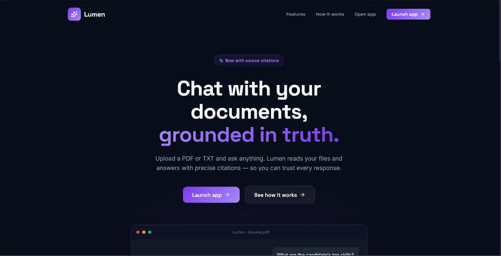
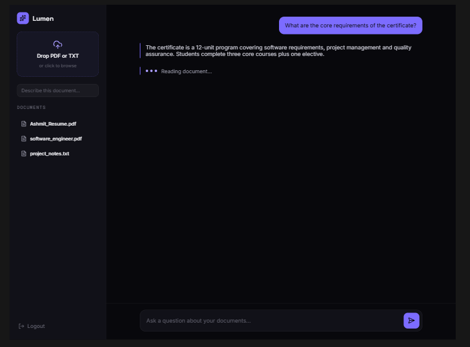

# Adaptive RAG - Lumen UI

[](https://www.python.org/)
[](https://fastapi.tiangolo.com/)
[](https://react.dev/)
[](https://python.langchain.com/langgraph/)

## 📋 Overview

**Adaptive RAG** is an intelligent, end-to-end Retrieval-Augmented Generation (RAG) system powered by an agentic AI architecture. It features **Lumen UI**, a premium, responsive React-based web interface for seamless document interaction.

The system dynamically routes queries based on classification, utilizing local vector-indexed documents, general LLM knowledge, or real-time web search (Tavily). It uses **LangGraph** for workflow orchestration, **FastAPI** for high-performance backend serving, and **React + Vite** for a modern user experience.

---

## 🎨 Application Preview

### Landing Page


### Chat Dashboard


---

## 🎯 Key Features

### 🧠 Intelligent Query Routing
- **Adaptive Classification**: Automatically routes queries to the most appropriate processing pipeline.
- **Three Query Types**:
  - **Index**: Answers from uploaded documents using Qdrant vector database.
  - **General**: Answers leveraging the general knowledge of the LLM.
  - **Search**: Answers requiring live web search data.

### 🎨 Premium Lumen UI (React SPA)
- **Modern Design**: Dark-mode themed interface with frosted glass effects and sleek typography.
- **Document Management**: Drag-and-drop document uploads (PDF, TXT) integrated directly into the sidebar.
- **Markdown Chat**: Rich text formatting (bullet points, bold text, code blocks) using `react-markdown`.
- **JWT Authentication**: Full user signup and login flow with encrypted passwords via `bcrypt`.

### 🤖 Agentic AI Architecture
- **Multi-Agent System**: Specialized agents orchestrated by LangGraph.
- **ReAct Framework**: Reasoning and Acting pattern for intelligent decision-making.

### 💾 Persistent State Management
- **MongoDB Backend**: Persistent chat history and document ownership tracking.
- **User Sessions**: Individual conversation contexts secured via JWT.

---

## 🏗️ Architecture Stack

| Component | Technology |
|-----------|-----------|
| **Frontend Framework** | React + Vite |
| **Backend Framework** | FastAPI + Uvicorn |
| **LLM Framework** | LangChain / LangGraph |
| **Vector Database** | Qdrant |
| **Document Database** | MongoDB |
| **Authentication** | JWT (`python-jose`, `passlib`, `bcrypt`) |

### WorkFlow


---

## 📖 Usage Guide

### 1. Prerequisites

- Python 3.9+
- Docker & Docker Compose
- Node.js 20+ (for local frontend development)
- OpenAI API key
- Tavily API key (for web search)

### 2. Environment Configuration

Create a `.env` file in the project root:

```env
# OpenAI Configuration
OPENAI_API_KEY=your_openai_api_key_here

# Tavily Search Configuration
TAVILY_API_KEY=your_tavily_api_key_here

# Qdrant Configuration
QDRANT_URL=http://qdrant:6333
QDRANT_API_KEY=your_qdrant_api_key
QDRANT_CODE_COLLECTION=code_documents
QDRANT_DOCS_COLLECTION=documents

# MongoDB Configuration
MONGODB_URL=mongodb://mongodb:27017
MONGODB_DB_NAME=adaptive_rag
```

### 3. Running the Application (Docker)

The easiest way to run the full stack (Frontend, Backend, MongoDB, Qdrant) is using Docker Compose:

```bash
# Build and start all services in the background
docker-compose up --build -d
```

- **Lumen UI (Frontend)**: http://localhost:5173
- **FastAPI (Backend)**: http://localhost:8000
- **API Docs**: http://localhost:8000/docs

### 4. Running Locally for Development

If you prefer to run services manually for development:

**Terminal 1 (Backend):**
```bash
python -m venv venv
source venv/bin/activate  # On Windows: venv\Scripts\activate
pip install -r requirements.txt
python -m uvicorn src.main:app --reload --host 0.0.0.0 --port 8000
```

**Terminal 2 (Frontend):**
```bash
cd frontend
npm install
npm run dev
```

---

## 🔌 API Endpoints (Backend)

- `POST /auth/register`: Create a new user account.
- `POST /auth/login`: Authenticate and receive a JWT token.
- `GET /documents`: Fetch uploaded documents for the authenticated user.
- `DELETE /documents/{doc_id}`: Delete an uploaded document.
- `POST /rag/query`: Submit a query and session ID for a RAG response.
- `POST /rag/documents/upload`: Upload PDF/TXT for vector indexing.

---

## 🔐 Security Considerations

- API keys are managed securely via `.env` files.
- Passwords are hashed using `bcrypt` before storage in MongoDB.
- All endpoints interacting with documents and queries require JWT authentication via `Authorization: Bearer <token>`.

---

## 👤 Author

**Ashmit Kumar Srivastav**
- GitHub: [@Ashmit76311](https://github.com/Ashmit76311)
- Project: [Adaptive RAG](https://github.com/Ashmit76311/Lumen_RAG)
